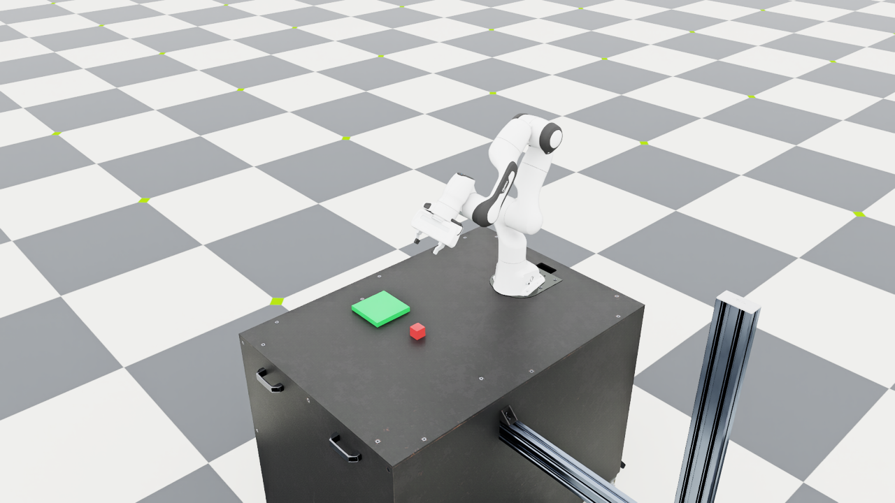

# Language-Guided Robot Manipulation

A small learning project with a Franka Panda in Isaac Lab. I am building
it incrementally: a custom scene, basic manipulation skills, and now a
small English/Chinese command interface connected to symbolic goals.

Current baseline pipeline:

```text
natural language → structured goal → task planner → skills → IK/controller → simulation
```

The language parser uses a few explicit templates. Object poses come from
the simulator. This is a runnable learning baseline, with no LLM or
learned perception yet.

Current progress:

- [Day 1: environment setup](docs/day1.md) — official examples, IK,
  gripper control, and WebRTC streaming.
- [Day 2: custom scene](docs/day2.md) — Panda, table, movable red cube,
  and fixed green platform.
- [Day 3: pick and place](docs/day3.md) — position-based skills connected
  to differential IK and the gripper, with observed object-state checks.
- [Day 4: language and symbolic planning](docs/day4.md) — supported English
  and Chinese commands become validated goals and legal skill sequences.
  Symbolic effects are recorded after physical success checks.



Tested environment: Ubuntu 26.04, RTX 3080 10GB, Isaac Lab develop
(`VERSION` 3.0.0), and Isaac Sim 6.1. Commands use the existing Isaac Lab
checkout and its uv-managed environment.

```bash
conda activate robot-demo
cd ~/robotics/IsaacLab
LD_LIBRARY_PATH="$CONDA_PREFIX/lib${LD_LIBRARY_PATH:+:$LD_LIBRARY_PATH}" \
uv run --no-sync python \
  ../language-guided-robot-manipulation/scripts/day4_language.py \
  --instruction "put the red cube on the green platform" \
  --viz kit --livestream 2 --keep_open
```

`--instruction "把红色方块放到绿色平台上"` requests the same goal. To lift
only, use `--instruction "pick up the red cube"`. Each invocation starts
a fresh scene. Unsupported requests are rejected before simulation starts.

Replace the rendering flags with `--dry_run` to preview the goal and plan
without launching Kit. Omit `--keep_open` for a bounded simulation attempt
that returns a failure code on timeout or interruption. The old
`day3_pick.py --place` interface still works.

See the daily notes for supported phrases, verification commands, measured
results, and limitations.


