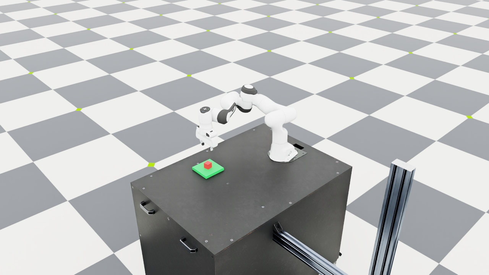

# Language-Guided Robot Manipulation

A small learning project with a Franka Panda in Isaac Lab. I am building
it incrementally, starting with a custom scene and basic manipulation
skills before connecting language instructions to symbolic goals.

Planned pipeline:

```text
natural language → structured goal → task planner → skills → IK/controller → simulation
```

Current progress:

- [Day 1: environment setup](docs/day1.md) — official examples, IK,
  gripper control, and WebRTC streaming.
- [Day 2: custom scene](docs/day2.md) — Panda, table, movable red cube,
  and fixed green platform.
- [Day 3: pick and place](docs/day3.md) — position-based skills connected
  to differential IK and the gripper, with observed object-state checks.


Tested environment: Ubuntu 26.04, RTX 3080 10GB, Isaac Lab develop
(`VERSION` 3.0.0), and Isaac Sim 6.1. Commands use the existing Isaac Lab
checkout and its uv-managed environment.

```bash
conda activate robot-demo
cd ~/robotics/IsaacLab
LD_LIBRARY_PATH="$CONDA_PREFIX/lib${LD_LIBRARY_PATH:+:$LD_LIBRARY_PATH}" \
uv run --no-sync python \
  ../language-guided-robot-manipulation/scripts/day2_scene.py \
  --viz kit --livestream 2
```

See the daily notes for bounded checks, screenshots, and limitations.
This is currently a simulation demo with known object poses; it has no
learned perception or language model yet.

To run the full pick-and-place demo, replace `day2_scene.py` above with
`day3_pick.py` and add `--place --keep_open`. Omit `--keep_open` for a
bounded attempt that returns a failure code on timeout or interruption.


