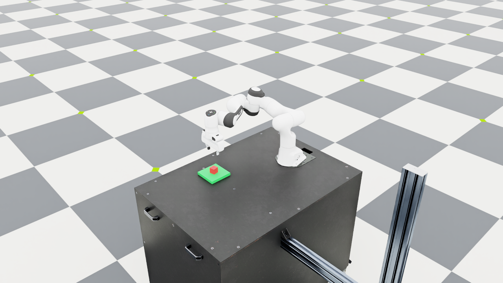

# Language-Guided Robot Manipulation

A small learning project with a Franka Panda in Isaac Lab. I am building
it incrementally: a custom scene, basic manipulation skills, and now a
small English/Chinese command interface connected to symbolic goals.

Start with the [project overview](docs/project_overview.md) for the scope,
recorded results, and current limitations.

Current baseline pipeline:

```text
natural language → structured goal → task planner → skills → IK/controller → simulation
```


Sampled Kit viewport recording of a model-translated placement request.
[Frame metadata and verified physical result](docs/images/day8_manipulation.json).

The default language parser uses explicit templates. An optional local
Qwen model front end is experimental and can misunderstand requests;
its initial language check scored 15/24 versus 16/24 for the rules.
An optional `guarded` entry adds conservative literal checks and explicit
rules/model attribution; it still rejects some valid requests.
Object poses come from the simulator; there is no learned perception.

Current progress:

- [Day 1: environment setup](docs/day1.md) — official examples, IK,
  gripper control, and WebRTC streaming.
- [Day 2: custom scene](docs/day2.md) — Panda, table, movable red cube,
  and fixed green platform.
- [Day 3: pick and place](docs/day3.md) — position-based skills connected
  to differential IK and the gripper, with observed object-state checks.
- [Day 4: language and symbolic planning](docs/day4.md) — supported English
  and Chinese commands become validated goals and legal skill sequences.
  Symbolic effects are recorded after physical success checks.
- [Day 5: fixed-position evaluation](docs/day5.md) — a repeatable grid
  protocol with structured results and failure accounting.
- [Day 6: local model experiment](docs/day6.md) — optional CPU inference,
  strict goal validation, and a comparison that retains model errors.
- [Day 7: request checks](docs/day7.md) — explicit entity/action checks,
  model-conflict rejection, and a second small language comparison.
- [Day 8: demo recording](docs/day8.md) — real motion frames and a
  reproducible GIF recording command, with the execution result retained.
- [Day 9: failed grasp check](docs/day9.md) — an injected open-gripper
  fault verifies that motion alone cannot commit a successful skill effect.
- [Day 10: project presentation](docs/day10.md) — a short overview and
  an internship inquiry draft grounded in the actual project scope.
- [Day 11: constraint diagnostic](docs/day11.md) — extra requirements
  expose false acceptances that the initial request checks missed.

Tested environment: Ubuntu 26.04, RTX 3080 10GB, Isaac Lab develop
(`VERSION` 3.0.0), and Isaac Sim 6.1. Commands use the existing Isaac Lab
checkout and its uv-managed environment.

```bash
conda activate robot-demo
cd ~/robotics/IsaacLab
LD_LIBRARY_PATH="$CONDA_PREFIX/lib${LD_LIBRARY_PATH:+:$LD_LIBRARY_PATH}" \
uv run --no-sync python \
  ../language-guided-robot-manipulation/scripts/day4_language.py \
  --instruction "put the red cube on the green platform" \
  --viz kit --livestream 2 --keep_open
```

`--instruction "把红色方块放到绿色平台上"` requests the same goal. To lift
only, use `--instruction "pick up the red cube"`. Each invocation starts
a fresh scene. Unsupported requests are rejected before simulation starts.

Replace the rendering flags with `--dry_run` to preview the goal and plan
without launching Kit. Omit `--keep_open` for a bounded simulation attempt
that returns a failure code on timeout or interruption. The old
`day3_pick.py --place` interface still works.

See the daily notes for supported phrases, verification commands, measured
results, and limitations.



To evaluate the two placement commands over the preset nine-position grid,
from the same environment and Isaac Lab directory:

```bash
LD_LIBRARY_PATH="$CONDA_PREFIX/lib${LD_LIBRARY_PATH:+:$LD_LIBRARY_PATH}" \
uv run --no-sync python \
  ../language-guided-robot-manipulation/scripts/day5_evaluate.py
```

Add `--dry_run` to preview the 18 cases, or `--limit 1` for a smoke check.
Every attempt starts a fresh scene. The runner preserves failure rows and
partial reports and prints the output path.

The recorded [Day 5 results](docs/results/day5_grid.json) passed all 18
attempts, with a maximum horizontal placement error of about 3.19 mm.
This covers nine fixed starting positions and two equivalent command
templates; it is a small baseline check with no randomized repeats.
