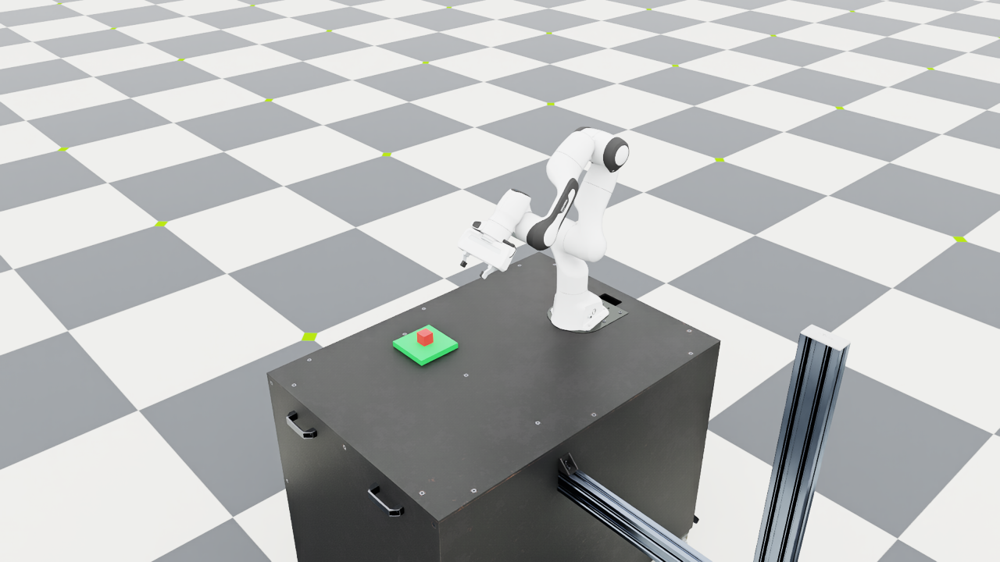

# Day 13 — Planning from another initial state

## Goal

Until now, every live command started with the cube on the table. The
planner could handle a cube on the green platform, but I had only tested
that case in Python. I added a second initial scene to check it in physics.

## Changes

The language demo accepts `--cube_start green_platform`. It spawns the
cube just above the platform and lets it settle for the usual 60 steps.
The executor still determines the initial symbolic state from the measured
cube position and velocity. It does not use the flag as proof of support.

The default remains `table`. The table position flags `--cube_x` and
`--cube_y` cannot be combined with the platform start, so a coordinate is
not silently ignored. Dry runs use the selected assumed surface; they
do not measure a physical state.

If the place goal is already satisfied, the planner returns an empty
plan. The executor now prints a structured result with
`execution_status: already_satisfied`, zero manipulation steps, zero
cube rise, and zero skill hold time. The 60 settling steps are separate.
There is no grasp or placement attempt to count as a successful skill.
Screenshots and keeping the scene open are supported; motion recording
for this no-op placement is rejected before Kit starts.

## Actual runs

All three behavioral checks used the rule language parser and fresh scenes.

| Initial surface | Request | Plan | Observed result |
| --- | --- | --- | --- |
| Table | Place | pick → place | Verified at 2554 manipulation steps, matching the earlier baseline |
| Green platform | Place | Empty | Cube settled near z = 0.040 m; goal already satisfied; zero manipulation steps |
| Green platform | Pick | pick | Verified at 1933 steps; rise 0.19844 m; hold 0.50 s |

The [structured records](results/day13_initial_state.json) retain the
actual results and traces. A fourth run repeated the platform placement
with rendering to save the screenshot below. It also returned the empty
plan. This is a check of one additional starting state, not a new
robustness benchmark or online replanning.



All 92 fast tests passed. New CLI checks cover both platform preview
plans, conflicting coordinates, and no-op recording rejection. The opt-in
simulator check verifies actual initial support, the empty-plan result,
and the physical lift from the platform. Isaac Lab's existing AppLauncher
deprecation and static-prim rigid-body warnings remain; these runs exited
cleanly and passed their measured state checks.

## Try it

From the existing `robot-demo` environment and Isaac Lab directory:

```bash
LD_LIBRARY_PATH="$CONDA_PREFIX/lib${LD_LIBRARY_PATH:+:$LD_LIBRARY_PATH}" \
uv run --no-sync python \
  ../language-guided-robot-manipulation/scripts/day4_language.py \
  --instruction "put the red cube on the green platform" \
  --cube_start green_platform
```

Change the instruction to `pick up the red cube` to lift it from the
platform. Add `--dry_run` to preview either plan without launching Kit.
To repeat the two physical assertions:

```bash
LD_LIBRARY_PATH="$CONDA_PREFIX/lib${LD_LIBRARY_PATH:+:$LD_LIBRARY_PATH}" \
uv run --no-sync python \
  ../language-guided-robot-manipulation/tests/simulation_exit_checks.py \
  SimulationExitTests.test_platform_start_uses_observed_state
```

## What I learned

A request describes the goal, but the starting state determines the work
needed. An empty plan can be the correct result. Reporting that separately
from manipulation helps avoid claiming that the robot moved an object
when it was already at the destination.
