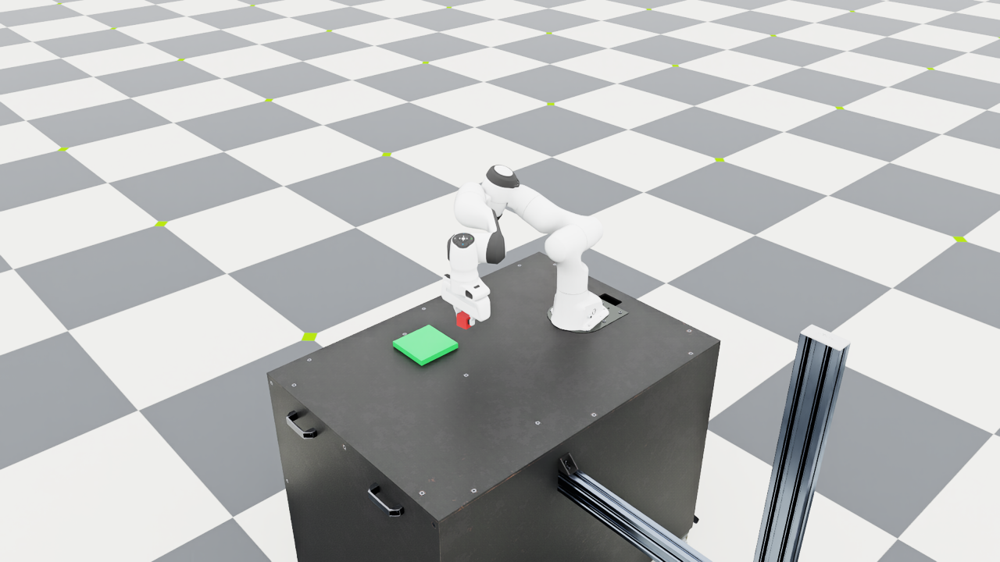

# Day 3 — Connecting pick and place skills to the robot

## Goal

The scene from Day 2 was ready, but the robot was still standing still.
I wanted to connect the small pick state machine to our own scene and
check that the red cube actually moves. After getting the lift working,
I added placement on the green platform.




## What I built

`scripts/day3_pick.py` connects the skills to differential IK and the
Panda gripper. It reuses the Day 2 scene and supports one environment.

The sequence is:

```text
rest → above cube → approach → close fingers → lift
     → above platform → lower → open fingers → retract
```

`skills/pick.py` returns a position target and whether the gripper should
be closed. `skills/place.py` does the same for placement. The runner
converts those targets into arm joint commands using differential IK.
This separation should let a later planner call the skills without
handling joint angles itself.

The arm uses Isaac Lab's high-PD Panda configuration. The controller
targets a grasp point 107 mm along the hand's local z axis, rather than
the hand origin. I also apply this offset to the Jacobian. Otherwise the
controller would move the wrong point to the cube. Quaternions in this
checkout use `(x, y, z, w)`.

## How I checked success

Reaching the `LIFT` phase is not enough: the fingers could close without
the cube. The runner checks the observed cube and TCP positions.

A successful pick requires all of these for 0.5 seconds:

- The cube rises at least 10 cm from its settled starting height.
- The cube remains within 5 cm of the TCP.
- The TCP is within 1.5 cm of the commanded lift goal.

The lift goal is 20 cm above the starting cube center. For placement,
the cube must be within 4 cm horizontally and 8 mm vertically of the
platform's desired cube center. It must also have small linear and
angular velocities, with the fingers commanded open and the TCP retracted. These
checks must hold for 0.5 seconds after the placement sequence finishes.
The cube moves through contact and gravity; the runner does not teleport
it or attach it to the gripper.

## Results

These are individual runs, not a statistical success-rate benchmark.
The target platform center is `(0.5, -0.22)`, with the placed cube center
expected at `z = 0.04 m`.

| Initial cube x, y (m) | Measured lift (m) | Full pick/place steps | Final cube x, y, z (m) |
| --- | --- | --- | --- |
| 0.50, 0.00 | 0.1985 | 2554 | 0.50018, -0.21948, 0.04000 |
| 0.45, 0.08 | 0.1986 | 2770 | 0.49988, -0.21948, 0.04000 |
| 0.55, -0.08 | 0.1986 | 2555 | 0.49997, -0.21939, 0.04000 |

All three complete runs exited with code `0`. Physics steps are 0.01 s;
these totals exclude the initial 60 settling steps. The default pick-only
run completed in 1813 steps. A separate rendered run provided the pick
screenshot.

There are also 11 fast unit tests for the two skills and two opt-in checks
that launch the real simulator. The latter check a deliberately too-short
attempt and a Ctrl+C interruption. All passed.

## Running the demo

```bash
conda activate robot-demo
cd ~/robotics/IsaacLab
LD_LIBRARY_PATH="$CONDA_PREFIX/lib${LD_LIBRARY_PATH:+:$LD_LIBRARY_PATH}" \
uv run --no-sync python \
  ../language-guided-robot-manipulation/scripts/day3_pick.py \
  --place --viz kit --livestream 2 --keep_open
```

Remove `--place` to only pick and lift. Remove `--keep_open` for a bounded
run. The default timeout is 3000 steps for pick and 6000 for pick/place.
`--cube_x` and `--cube_y` change the starting position; only the three
positions above have been checked so far.

To save a placement screenshot, replace `--keep_open` with:

```text
--screenshot ../language-guided-robot-manipulation/docs/images/day3_place.png
```

Fast tests, from the same Isaac Lab directory:

```bash
PYTHONPATH=../language-guided-robot-manipulation \
uv run --no-sync python -m unittest discover \
  -s ../language-guided-robot-manipulation/tests -v
```

Real-simulator failure checks:

```bash
LD_LIBRARY_PATH="$CONDA_PREFIX/lib${LD_LIBRARY_PATH:+:$LD_LIBRARY_PATH}" \
uv run --no-sync python \
  ../language-guided-robot-manipulation/tests/simulation_exit_checks.py
```

## Problems I fixed

- The original pick skill counted travel time as settling time. Tests
  showed that it could advance immediately after reaching the object.
  It now counts only continuous time near the approach target.
- The first 18-second attempt lifted the cube but timed out just before
  completing the hold check. A 30-second limit let the pick finish.
- Code review caught an interruption bug: Ctrl+C could exit with code
  `0` because of the launcher's shutdown handling. I reproduced it with
  a subprocess check and added explicit code `130` for interruptions.
- I switched arm and finger targets to the current actuator command API.
  Only the leading finger has an active drive; the other finger follows
  the asset's mimic constraint.

## Limitations and next step

This is still a small simulation baseline. It uses known simulator object
poses, a fixed downward grasp orientation, and one cube. The first
approach is slow, and there is no grasp retry or obstacle-aware path
planning. The three runs do not prove general robustness. `AppLauncher`
and remote Kit warnings remain as described in Day 2.

There is no language interface yet. Next I want to represent a request
such as “put the red cube on the green platform” as a structured goal,
then map it to these verified skills. I want to keep the physical success
checks when adding that layer.
