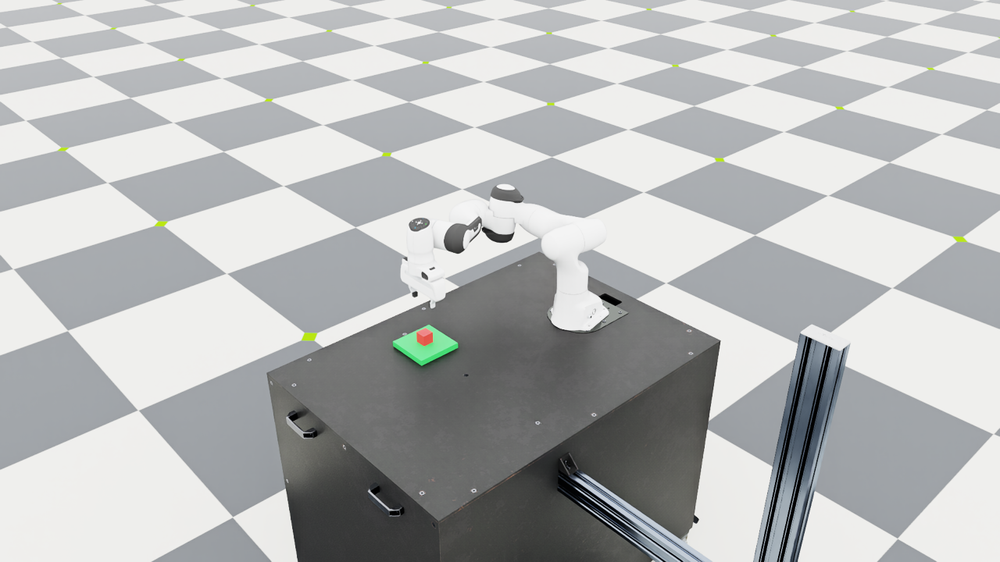

# Day 5 — Checking the same demo at more starting positions

## Goal

The Day 4 language pipeline worked at the default cube position. I wanted
to check more positions using a fixed protocol and save the results, so
I would not rely only on a successful screenshot.

I kept the controller, grasp orientation, skill timings, and success
checks unchanged during this evaluation. This tests the current baseline;
it does not train a policy or tune the grasp.

## The experiment

The cube starts at each combination of:

- `x = 0.4, 0.5, 0.6 m`
- `y = -0.1, 0.0, 0.1 m`

That gives nine positions. At each position, I run these two requests:

```text
put the red cube on the green platform
把红色方块放到绿色平台上
```

Each request starts a new simulator process and a fresh scene. Both
requests should produce the same structured goal and `[pick, place]`
plan. There are 18 attempts in total, with one attempt per position and
language. The paired requests share the same physical setup; they do not
provide 18 independent grasp conditions.

The runs disable rendering, use a 0.01 s physics timestep, and allow 6000
execution steps plus 60 initial settling steps. Each child process also
has a 120 s wall-clock limit, including startup. The target cube center
is `(0.5, -0.22, 0.04)` m. Environment details are in [Day 2](day2.md).

## What I added

`scripts/day5_evaluate.py` runs the cases sequentially using the same
Python interpreter as `uv run`. It saves a full local log for every
attempt and updates `report.json` after each attempt. It refuses to
overwrite an existing output directory.

The shared executor now prints a `[RESULT]` JSON record after physical
verification. It includes the goal, executed plan, final symbolic state,
observed cube positions, lift height, step count, timestep, and hold time.
The old Day 3 and Day 4 commands still work.

The evaluator requires a clean process exit and a complete, consistent
result. A missing result, malformed data, wrong goal, nonzero exit, or
process timeout is recorded as a failed attempt. Failed attempts remain
in the denominator. A Ctrl+C interruption saves a partial report and
exits with code `130`; it does not claim that the remaining cases ran.

The report contains selected actual trace lines, including the goal,
plan, phases, verified world-state updates, and result. Full Kit output
stays in the local experiment directory.

## Results

All 18 attempts completed with verified placement and exit code `0`.
The batch also exited with code `0`. The unchanged default position still
took 2554 execution steps, matching Day 4.

| Starting x, y (m) | English steps | Chinese steps | Verified placements |
| --- | --- | --- | --- |
| 0.40, -0.10 | 2780 | 2780 | 2/2 |
| 0.40, 0.00 | 2771 | 2771 | 2/2 |
| 0.40, 0.10 | 2766 | 2766 | 2/2 |
| 0.50, -0.10 | 2490 | 2490 | 2/2 |
| 0.50, 0.00 | 2554 | 2554 | 2/2 |
| 0.50, 0.10 | 2838 | 2838 | 2/2 |
| 0.60, -0.10 | 2610 | 2610 | 2/2 |
| 0.60, 0.00 | 2771 | 2771 | 2/2 |
| 0.60, 0.10 | 3033 | 3033 | 2/2 |

These step counts exclude the 60 settling steps. The measured cube rise
ranged from about 19.06 to 19.89 cm. The largest final horizontal error
from the platform center was about 3.19 mm. Every attempt produced the
expected `table → gripper → green_platform` verified state sequence.

The two requests produced identical step counts at each position. This
is consistent with both templates mapping to the same goal and plan in
the same fixed scene. It does not test flexible language understanding.

The [complete structured report](results/day5_grid.json) contains all
18 rows and their selected actual traces. It is a direct copy of the
generated report. The full local logs are in `.cache/day5/grid/`.



The screenshot is from an additional rendered run at `(0.6, 0.1)`,
separate from the 18 headless evaluation attempts.

I also ran 49 fast tests and six opt-in real-simulator checks; all passed.
The latter include the existing Day 3/4 timeout and interruption checks,
plus a batch with two deliberately too-short attempts and an interrupted
batch. The short attempts were both recorded as failures, and the
interrupted batch retained its partial report. These checks are separate
from the 18 placement attempts above.

Code review caught one data-validation issue: Python treats booleans as
numbers, so a malformed JSON metric could look valid. I added failing
cases for booleans and numeric overflow, then fixed the validation. I
rechecked all saved experiment logs with the final collector before
publishing the report. GitHub's CPU test subset now contains 34 tests.

## Running it

```bash
conda activate robot-demo
cd ~/robotics/IsaacLab
LD_LIBRARY_PATH="$CONDA_PREFIX/lib${LD_LIBRARY_PATH:+:$LD_LIBRARY_PATH}" \
uv run --no-sync python \
  ../language-guided-robot-manipulation/scripts/day5_evaluate.py
```

The script prints the report path. By default it creates a new timestamped
directory under the project’s `.cache/day5/`. To choose a new directory,
add `--output ../language-guided-robot-manipulation/.cache/day5/my_grid`.

Use `--dry_run` to inspect all cases without launching Isaac Sim, or
`--limit 1` for a single smoke run. The batch exits with code `1` if any
attempt fails, while still saving and continuing through the other cases.
`--max_steps 1 --limit 2` deliberately makes both attempts too short;
it checks failure reporting and is not part of the nine-position result.

The fast and real-simulator test commands remain the same as in
[Day 3](day3.md#running-the-demo). GitHub Actions only checks syntax and
the pure-Python parser, planner, grounding, and evaluation tests; it does
not run Isaac Sim.

## What I learned

A useful experiment needs a record of the protocol and every outcome.
Checking the exit code is also not enough: a program can exit normally
without proving that the cube was placed. Keeping the measured result
separate from process status made these cases easier to test.

The positions form a small, fixed grid with the same object, target,
orientation, and physics settings. They do not measure robustness to
random disturbances, different cubes, obstacles, camera errors, or
arbitrary language. There are no randomized repeats or grasp retries.
Wall-clock times include simulator startup and are not a controller
performance benchmark.

The parser is still template-based and the object poses still come from
the simulator. A later language adapter should preserve the structured
goal validation and the physical success checks.
