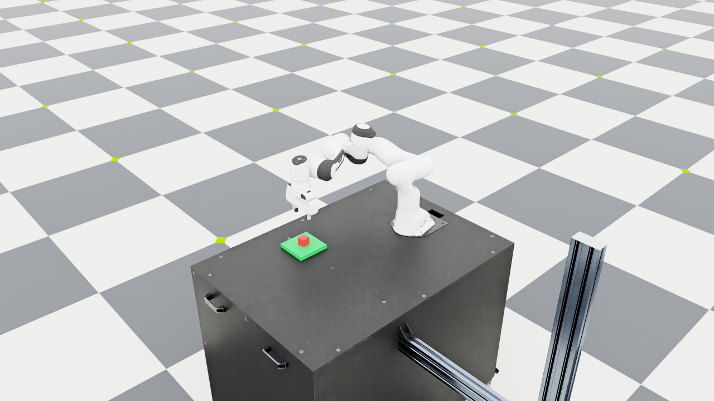

# Day 6 — Trying a small local language model

## Goal

The rule parser only accepts fixed templates. I wanted to try a pretrained
language model as another front end, while keeping the same goal schema,
planner, skills, and physical checks. I also wanted to compare its actual
outputs with the rules, including requests that should be rejected.

## Implementation

I used [Qwen2.5-1.5B-Instruct](https://huggingface.co/Qwen/Qwen2.5-1.5B-Instruct),
at revision `989aa7980e4cf806f80c7fef2b1adb7bc71aa306`. This is a pretrained
model; I did not fine-tune it. The existing Isaac Lab environment already
had Transformers 5.10.4 and Torch 2.12.0, so I installed no new packages.
The weights are downloaded into the project's ignored `.cache/day6/`.

`planning/llm.py` runs the model on CPU in a separate process. The process
finishes before `AppLauncher` starts Isaac Sim, so the model does not
compete with rendering for the RTX 3080's memory. Generation is greedy,
with float32 weights, eight CPU threads, and at most 128 new tokens.

The prompt describes the red cube, green platform, allowed goals, and
rejection conditions, with six examples. The model must return either:

```json
{"status":"ok","goal":{"action":"place","object":"red_cube","target":"green_platform"}}
```

or a rejection containing `status` and a short `reason`. Python validates
the entire response. Unknown entities or actions, missing or extra fields,
duplicate JSON fields, explanatory prose, and multiple JSON objects are
not accepted. The model does not generate joint commands or skill plans.
The existing planner handles an accepted goal.

The Day 4 script has an optional `--language_backend llm`. Rules remain
the default, and there is no fallback that hides model failures. The model
worker has a 120 s deadline; timeout or invalid output exits before the
simulator starts. Argument checks also happen before expensive inference.

## Language results

I wrote [24 labeled requests](../evaluation/language_cases.json): six pick
requests, six place requests, and twelve requests that should be rejected.
They include English and Chinese templates, paraphrases, unknown entities,
negation, ambiguous references, an unsupported action, and a contradictory
constraint. This is a small hand-written diagnostic set, not a general
language benchmark or an independent test of model training data.

| Expected behavior | Requests | Rules correct | Local model correct |
| --- | --- | --- | --- |
| Supported goal | 12 | 4 | 9 |
| Reject unsupported request | 12 | 12 | 6 |
| Total | 24 | 16 | 15 |

The model handled more supported paraphrases, but performed worse overall
on this set. It falsely accepted four unsupported requests and produced
three invalid outputs. Invalid output is not credited as a correct
semantic refusal, even when validation prevents execution.

Some mistakes were instructive:

- It rejected “Would you mind grabbing the red block for me?” because it
  said the red block was unknown, despite the prompt's synonym.
- A transfer request produced separate pick and place JSON objects.
  Full-response validation rejected them.
- A Chinese pick-then-place request was mapped to pick alone.
- A negated lift request, two ambiguous requests, and a no-lift placement
  constraint were mapped to executable goals. Schema validation cannot
  detect those semantic errors.

The [complete model report](results/day6_language.json) contains every
raw response, expected goal, rule/model prediction, the full prompt and
examples, and generation settings. I kept the failed rows and did not
revise the prompt after seeing these results.

## Physical demonstration

I checked two requests that the model translated correctly in the
language-only set:

| Request | Generated goal | Verified robot result |
| --- | --- | --- |
| `Please lift the red cube off the table and keep holding it.` | pick | 1813 steps; cube rose about 19.85 cm |
| `麻烦把桌上的红色小方块搬到绿色平台上。` | place | 2554 steps; cube center near `(0.50018, -0.21948, 0.04000)` m |

Both runs exited with code `0`. The second used the actual renderer:



A separate live request for the blue cube exited with code `2` before
Kit started. The model proposed an unknown object, and schema validation
blocked it. That is different from the model correctly refusing the
request itself.

The fast suite now has 60 passing tests, including strict response
validation, semantic scoring, and a real CLI model-worker timeout. The
GitHub subset has 43 pure-Python tests and does not load model weights.
The six existing real-simulator timeout and interruption checks also
passed with the rules still selected by default. The
[actual execution traces](results/day6_execution.json) are saved separately
from the language-only results.

## Running the experiment

Download the pinned model once:

```bash
conda activate robot-demo
cd ~/robotics/IsaacLab
uv run --no-sync python \
  ../language-guided-robot-manipulation/scripts/day6_download_model.py
```

Inspect a model-generated goal before launching the simulator:

```bash
uv run --no-sync python \
  ../language-guided-robot-manipulation/scripts/day4_language.py \
  --language_backend llm \
  --instruction "麻烦把桌上的红色小方块搬到绿色平台上。" --dry_run
```

For the experimental live path, replace `--dry_run` with
`--viz kit --livestream 2 --keep_open` and use the `LD_LIBRARY_PATH` prefix
from [Day 4](day4.md#running-it). The simulator executes the accepted goal;
a schema-valid model response may still misunderstand the instruction.

Run the language-only comparison without launching Isaac Sim:

```bash
uv run --no-sync python \
  ../language-guided-robot-manipulation/scripts/day6_evaluate.py
```

It creates a new project-local report directory and prints its path.
Always run these commands from Isaac Lab: running `uv` from the project
directory selects a different Python environment in this setup.

## What I learned

A valid goal schema and a physically successful action are two different
checks. There is also a third question: did the goal match what the user
actually asked? The small model made mistakes on that step even when its
JSON looked correct. A successful demonstration with one paraphrase does
not establish reliable instruction following.

This model entry is experimental. The rule baseline stays available, and
all object positions still come from the simulator. There is no visual
grounding, training, obstacle-aware motion planning, or failure recovery.
Next I want to test explicit entity/negation checks and a clearer prompt,
while retaining this initial result for comparison.
