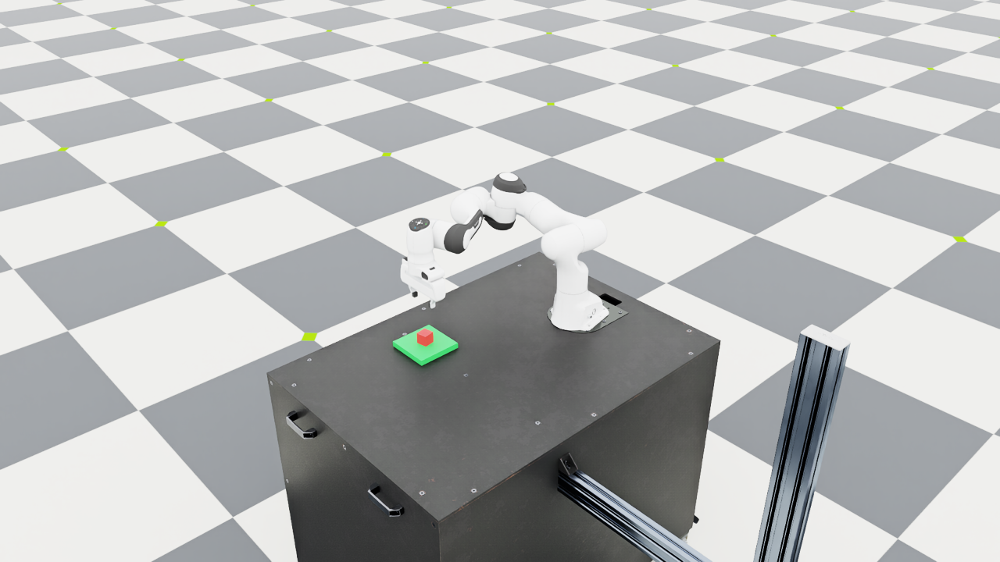

# Day 7 — Checking requests before execution

## Goal

Day 6 showed that valid JSON does not mean the model understood a request.
I wanted to block some clear mistakes before the simulator starts. I kept
the same model, prompt, generation settings, planner, and robot controller.

## Implementation

The optional `--language_backend guarded` checks the request first. It
requires the red cube to be named explicitly. Placement also requires the
green platform. A small list of literal patterns rejects negation, unknown
colors, unsupported actions, and relations such as “beside” the platform.

An exact command template uses the existing rules. Other requests go to
the actual local model. After its JSON passes validation, the proposed
final action must agree with the explicit pick/place words. A mismatch
is rejected; the code does not change a wrong pick goal into a place goal.
Model refusals and malformed responses do not trigger a fallback.

The output records whether rules or the model supplied the accepted goal.
`rules` is still the default backend. The separate `llm` backend remains
available so the unguarded result can be reproduced.

These checks are conservative string patterns. For example, “grabbing”
is not covered by the action pattern for “grab”, so a valid request can
be rejected. More complicated intent can also escape the checks. This is
a small domain restriction, not a general solution to language grounding.

## Language checks

I reran the original 24 requests and wrote another
[24 requests](../evaluation/language_cases_day7.json) before implementing
the checks. Each set has 12 supported goals and 12 rejection cases. The
new set uses different wording but is still a small hand-written check;
it is not a large benchmark or a test of unseen model training data.

The evaluator runs the raw model on every request, including requests that
the guard or rules would handle without inference. The raw model score
and the guarded score are separate. A guard rejection gets attributed to
the guard, not to the model. Malformed model output gets no semantic
rejection credit. All raw outputs are retained.

On the original set, rules scored 16/24, the raw model scored 15/24, and
the guarded entry scored 21/24. It blocked all 12 unsupported requests
on that set. Three supported requests still failed: the uncovered
“grabbing” form, a two-JSON transfer response, and a Chinese placement
request for which the model proposed pick alone. Blocking the latter
prevents the wrong execution but does not fulfill the requested task.

[Full development-set report](results/day7_development_language.json).

On the new set, the results were:

| Expected behavior | Requests | Rules | Raw model | Guarded entry |
| --- | --- | --- | --- | --- |
| Supported goal | 12 | 0 | 9 | 9 |
| Reject unsupported request | 12 | 12 | 4 | 12 |
| Total correct | 24 | 12 | 13 | 21 |

The raw model falsely accepted seven unsupported requests and produced
four invalid outputs. The guarded entry had zero false acceptances in
this set, but three supported requests still failed due to malformed or
out-of-schema model output. Every accepted new-set goal came from the
model; none matched the exact rule templates. This small set does not
show that other unsupported requests will be caught.

The [new-set report](results/day7_new_language.json) retains all cases.
The original-set raw outputs, prompt, and model settings matched Day 6
exactly. I did not tune the model or prompt after either comparison.

## Execution checks

The fast suite has 78 passing tests. The GitHub subset has 59 pure-Python
tests and needs no model weights. Six real-simulator checks for timeout,
interruption, and partial batch results passed with the default rules.

Two live unsupported requests, “Do not lift the red cube.” and
“Put that thing over there.”, exited with code `2` before model inference
or Kit startup. A separate request,
“请先抓起红色方块，然后把它放到绿色平台上。”, reached the model,
which proposed pick alone. The post-model check rejected the conflict
before Kit startup, also with code `2`.

Two supported requests from the new language set also passed the full
physical pipeline:

| Request | Goal source | Verified outcome |
| --- | --- | --- |
| `Please hold the red cube in your gripper.` | model | pick; 1813 steps; cube rise about 19.85 cm |
| `Please relocate the red cube onto the green target.` | model | place; 2554 steps; cube center near `(0.50018, -0.21948, 0.04000)` m |

Both exited with code `0`. Their controller results matched the earlier
runs at the same cube pose. This checks the new entry path, not additional
physical starting conditions. The placement run used the Kit renderer:



[Actual execution traces](results/day7_execution.json).

This launcher does not accept `--headless`; omitting rendering flags uses
the default mode. The existing AppLauncher deprecation and static-prim
rigid-body warnings still appeared, but the sustained object-state checks
passed. Isaac Lab source and environment dependencies were not changed.

## Running it

From the existing Isaac Lab environment:

```bash
conda activate robot-demo
cd ~/robotics/IsaacLab
uv run --no-sync python \
  ../language-guided-robot-manipulation/scripts/day4_language.py \
  --language_backend guarded \
  --instruction "Please hold the red cube in your gripper." --dry_run
```

For a live attempt, replace `--dry_run` with `--viz kit --livestream 2`
and use the `LD_LIBRARY_PATH` prefix shown in Day 4. Each invocation
starts a fresh scene. The model worker exits before Isaac Sim starts.

To reproduce the new language comparison without starting Isaac Sim:

```bash
uv run --no-sync python \
  ../language-guided-robot-manipulation/scripts/day6_evaluate.py \
  --guarded \
  --cases ../language-guided-robot-manipulation/evaluation/language_cases_day7.json
```

Omit `--cases` to rerun the original set. Add `--output` only for a new
project-local directory; existing results are not overwritten.

## What I learned

For a scene with one object and two allowed goals, simple explicit checks
already do much of the work. The model helps with some paraphrases, but
these results do not establish that a model is necessary for this task.
The guard should also be evaluated for rejecting valid requests, not just
for blocking bad ones. Complex qualifiers and intentions remain outside
this small set of string patterns.
