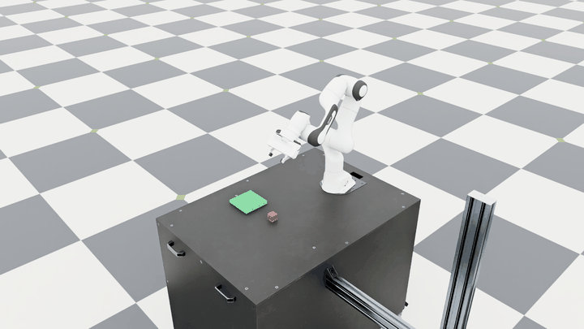

# Language-Guided Symbolic Robot Manipulation

A small undergraduate learning project in Isaac Lab: turn a supported
English or Chinese request into a structured goal, plan a legal sequence
of skills, and verify the resulting Franka manipulation in simulation.



The clip uses a real model-translated request. Its
[recording metadata](images/day8_manipulation.json) includes the raw model
response, requested frame steps, and verified physical result.

## What the demo does

The scene contains one Panda, a table, a movable red cube, and a fixed
green platform. A pick goal means lift and hold the cube; a place goal
means put it on the platform. Each command starts a fresh scene.
The cube starts on the table by default; an optional platform start checks
how a changed observed state changes the plan, including an empty plan
when the goal is already satisfied.

```text
request → validated goal → symbolic planner → skills → IK/gripper → simulation
                                                                ↓
                                         observed cube checks → verified effect
```

| Component | Current implementation |
| --- | --- |
| Language | Exact English/Chinese templates by default; optional pretrained CPU Qwen2.5-1.5B-Instruct; optional literal checks around the model |
| Goal | `pick(red_cube)` or `place(red_cube, green_platform)` |
| Planner | Breadth-first search over three handwritten cube-location states and two operators |
| Skills | Approach/grasp/lift and transfer/lower/release/retract phases |
| Control | Isaac Lab differential IK and the Panda gripper actuator |
| Verification | Observed cube rise, proximity, placement, velocity, and sustained checks before recording an effect |

The main code is [language parsing](../planning/language.py),
[model adapter](../planning/llm.py), [request checks](../planning/guarded_language.py),
[planner](../planning/symbolic.py), and [physical executor](../execution/franka.py).
Isaac Lab supplies the robot asset and differential IK controller. The
model is pretrained; the project does not train a policy or language model.

## Evidence and limits

| Check | Recorded outcome | Scope |
| --- | --- | --- |
| Placement grid | 18/18 verified attempts; maximum horizontal error about 3.19 mm | Nine fixed poses, paired English/Chinese templates; no randomized repeats |
| Original language set | Rules 16/24; raw model 15/24; guarded entry 21/24 | Twelve supported and twelve rejection cases |
| Second language set | Rules 12/24; raw model 13/24; guarded entry 21/24 | Another small hand-written set, written before implementing the checks |
| Simulated open-gripper fault | Both pick/place attempts rejected; no unverified skill effects | One artificial fault at one pose, with a normal pick control |
| Platform initial state | Placement needs no manipulation; pick verified at 1933 steps | One additional initial support, with an unchanged table-placement control |

[Grid results](results/day5_grid.json),
[original language comparison](results/day7_development_language.json),
[second language comparison](results/day7_new_language.json), and
[failed-grasp records](results/day9_fault_check.json) retain the actual
outcomes, including errors. The small model is unreliable on these checks.
The guarded entry blocked the Day 7 labeled rejection cases but also failed on
some supported requests. Its literal patterns are not general intent
understanding or a safety guarantee. A later [constraint diagnostic](day11.md)
found three false acceptances in 16 requests, including ignored handover
and waiting requirements. [Day 12](day12.md) adds explicit checks for
those known categories; its saved-response replay is not an independent
evaluation of generalization.

[Day 13 records](results/day13_initial_state.json) retain the platform
start and control runs. The empty-plan result counts zero manipulation
steps; it is an already-satisfied goal rather than a completed grasp.

Object positions come directly from the simulator. The project currently
has no visual grounding, learned skills, collision-aware motion planner,
online replanning, automatic recovery, or real-hardware execution. The
planner uses Python states and operators, rather than PDDL.

## Reproduce one attempt

Tested with Ubuntu 26.04, RTX 3080 10GB, Isaac Lab develop (`VERSION` 3.0.0),
and Isaac Sim 6.1, using the existing adjacent Isaac Lab checkout:

```bash
conda activate robot-demo
cd ~/robotics/IsaacLab
LD_LIBRARY_PATH="$CONDA_PREFIX/lib${LD_LIBRARY_PATH:+:$LD_LIBRARY_PATH}" \
uv run --no-sync python \
  ../language-guided-robot-manipulation/scripts/day4_language.py \
  --instruction "put the red cube on the green platform" \
  --viz kit --livestream 2
```

Use `--dry_run` instead of rendering flags to inspect the goal and plan.
[Day 6](day6.md) explains the optional model setup; [Day 8](day8.md) explains
recording; the [daily notes](../README.md) describe each measured check.

## Research direction

A related design idea appears in Xie and colleagues' study of
[language-to-planning-goal translation](https://arxiv.org/abs/2302.05128):
use the model as a goal translator and let an explicit planner handle
planning. This is the connection I want to explore; this demo is not a
reproduction of their PDDL experiments.

One next question is whether clarification can reduce false acceptance
without rejecting too many valid requests. A useful next experiment would
freeze a larger set of ambiguous and constrained requests, compare rules,
raw model, and request checks, and measure both wrong acceptances and
missed supported goals. This is a proposed next step, not implemented
clarification or a claimed research contribution.
